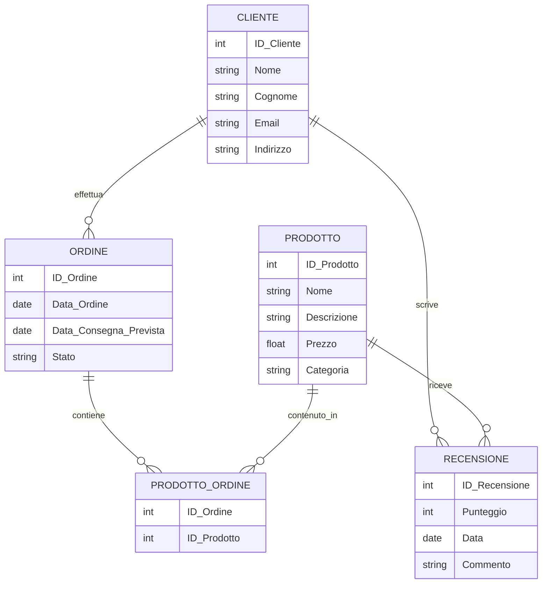

```mermaid
erDiagram
    CLIENTE {
        int ID_Cliente
        string Nome
        string Cognome
        string Email
        string Indirizzo
    }
    
    PRODOTTO {
        int ID_Prodotto
        string Nome
        string Descrizione
        float Prezzo
        string Categoria
    }
    
    ORDINE {
        int ID_Ordine
        date Data_Ordine
        date Data_Consegna_Prevista
        string Stato
    }
    
    RECENSIONE {
        int ID_Recensione
        int Punteggio
        date Data
        string Commento
    }
    
    CLIENTE ||--o{ ORDINE : effettua
    ORDINE ||--o{ PRODOTTO_ORDINE : contiene
    PRODOTTO ||--o{ PRODOTTO_ORDINE : contenuto_in
    CLIENTE ||--o{ RECENSIONE : scrive
    PRODOTTO ||--o{ RECENSIONE : riceve
    
    PRODOTTO_ORDINE {
        int ID_Ordine
        int ID_Prodotto
    }
```